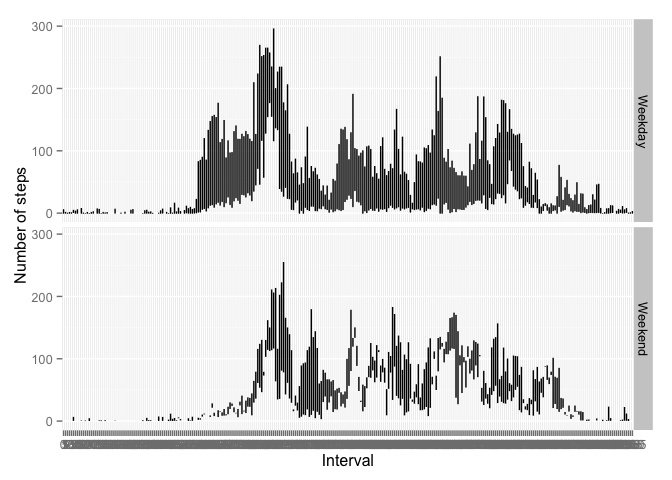

# Reproducible Research: Peer Assessment 1


## Loading and preprocessing the data

First we downoald the Activity monitoring data if they are still not downloaded and load them into a data frame.


```r
if(!file.exists('activity.csv')){
    unzip("activity.zip") 
}
activity <- read.csv("activity.csv", na.strings = "NA")
```

We need to transform the **date** into a proper format.


```r
activity$date <- as.Date(activity$date, format = "%Y-%m-%d") 
```


## What is mean total number of steps taken per day?

Here is how we can produce a histogram of the total number of steps taken each day.
The Mean and the Median are calculated over the total number of steps.
Here we will use **ddply** to summarize the date:


```r
day.activity <- ddply(activity, .(date), summarize, total.steps = sum(steps))
mu <- mean(day.activity$total.steps, na.rm = TRUE)
med <- median(day.activity$total.steps, na.rm = TRUE)

hist(day.activity$total.steps, 
     main = "Frequency of total number of steps per day", 
     xlab = "Total number of steps", 
     breaks = 10, 
     col = "yellow")

abline(v=mu, col = c("red"))
abline(v=med, col = c("green"), lty = 2)
legend("topright", c(paste("mean =", round(mu)), 
                     paste("median =", round(med))),
       col=c("red","green"), 
       lwd = 1, lty=2)
```

 

## What is the average daily activity pattern?

Here we can use the **aggregate** method to summarize the date:


```r
interval.activity <- aggregate(activity$steps, by = list(activity$interval), 
                               mean, na.rm = TRUE, na.action = NULL)
names(interval.activity) <- c("interval","average.steps")

plot(interval.activity$interval, interval.activity$average.steps,
     main="Average number of steps",
     xlab="Interval",
     ylab="Averaged number of steps across all days", 
     type="l")
```

 

The 5-minute interval, which contains the maximum number of steps across all days could be found as follow:


```r
m <- max(interval.activity$average.steps)
pik <- interval.activity[which(interval.activity$average.steps==m), 1]
pikH <- floor(pik/60)
pikM <- pik - pikH*60
paste("The pik interval ", pik, " in time format HH:MM = ", pikH ,":", pikM, sep = "")
```

[1] "The pik interval 835 in time format HH:MM = 13:55"

## Imputing missing values

First we will find all missing values:


```r
activity$interval <- as.factor(activity$interval)
interval.activity$interval <- as.factor(interval.activity$interval)

idxNA <- is.na(activity$steps)
sum(idxNA)
```

[1] 2304

We see there are a quite few of them. To get a better approximation of the steps frequency, we will substitute this missing values with already calculated interval activity from the known data.


```r
activityIMV <- activity
activityIMV[idxNA,"steps"] <- interval.activity[activityIMV[idxNA, "interval"],
                                               "average.steps"]

day.activityIMV <- ddply(activityIMV, .(date), summarize, total.stepsIMV = as.integer(sum(steps)))
muIMV <- mean(day.activityIMV$total.stepsIMV, na.rm = TRUE)
medIMV <- median(day.activityIMV$total.stepsIMV, na.rm = TRUE)

day.activityMerged <- merge(day.activity, day.activityIMV, by=1)
```

With so inputed missing values the frequency diagram looks like this:


```r
hist(day.activityMerged$total.stepsIMV, xlab="Total number of steps per day", main="Steps per day with imputed missing values", col="light blue", breaks = 10)

abline(v=muIMV, col = c("red"))
abline(v=medIMV, col = c("green"), lty = 2)
legend("topright", c(paste("mean =", round(muIMV)), 
                     paste("median =", round(medIMV))),
       col=c("red","green"), 
       lwd = 1, lty=2)
```

 

## Are there differences in activity patterns between weekdays and weekends?

First we will separate weekends from weekdays using the date with imputed missing values:


```r
activityIMV$wday <- as.factor(ifelse(as.POSIXlt(activity$date)$wday %% 6 == 0, "Weekend", "Weekday"));
activityIMV$dayofweek <- sapply(activityIMV$date, FUN = weekdays)

wday <- function(date) {
    ifelse(date %in% c("Saturday", "Sunday"), "Weekend", "Weekday")
}

activityIMV$wday <- sapply(activityIMV$dayofweek, FUN = wday)
```

Let's create a plot 


```r
aggr <- aggregate(steps ~ interval + wday, data=activityIMV, mean)

ggplot(aggr, aes(interval, steps)) + 
    facet_grid(wday ~ .) + 
    geom_line() +
    xlab("Interval") + ylab("Number of steps")
```

```
## geom_path: Each group consist of only one observation. Do you need to adjust the group aesthetic?
## geom_path: Each group consist of only one observation. Do you need to adjust the group aesthetic?
```

 

